# Data section: Attributes

## Attributes
|ID|RAt
|:--|:--
|**Designation**|**Attributes**
|**Description**|For the validation of the attributes, the rules defined in [[1]] Chap. 3.3.11 apply</td>
|**Details**|<ul><li>The value ```%AttributeName%``` must satisfy the ```AttributeDef``` ([[1]] Chap. 2.6) in the INTERLIS data model</li><li>The attribute type and the attribute value of ```AttributeValue``` must satisfy the ```AttrTypeDef``` ([[1]] Chap. 2.6 und 2.8) in the INTERLIS data model</li><li>For attributes of type ```NAME``` the rule *Names* ([[1]] Chap. 2.2.2) applies. Names that coincide with reserved words of the INTERLIS language ([[1]] Chap. 2.2.7) are not allowed</li></ul>
|**Reference**|[[1]] Chap. 2.2.2, 2.2.7, 2.6, 2.8 and 3.3.11

### Test cases
###### Attributes - RAt.T01
|ID|RAt.T01
|:--|:--
|**Designation**|**Attributes:** ```AttributeName```
|**Description**|The tests must check whether the value ```%AttributeName%``` satisfies the definition in the INTERLIS data model
|**Test requirement**|[RAt.T01a.xtf](../data/RAt.T01a.xtf)
|**Expected result**|<ul><li>RAt.T01a.xtf: error message. Value ```%AttributeName%``` is wrong</li></ul>
|**Reference**| [[1]] Chap. 2.6 and 3.3.11

###### Attributes - RAt.T02
|ID|RAt.T02
|:--|:--
|**Designation**|**Attributes:** ```TEXT```
|**Description**|The tests must check whether the attribute value satisfies the definition for ```TEXT``` in the INTERLIS data model and the corresponding encoding rules
|**Test requirement**|[RAt.T02a.xtf](../data/RAt.T02a.xtf), [RAt.T02b.xtf](../data/RAt.T02b.xtf), [RAt.T02c.xtf](../data/RAt.T02c.xtf)
|**Expected result**|<ul><li>RAt.T02a.xtf: no error message. Spaces are valid characters</li><li>RAt.T02b.xtf: error message. Attribute ```Art3``` must be limited to three characters</li><li>RAt.T02c.xtf: error message. ```TEXT``` must be encoded as a single-line text, control characters are not allowed</li></ul>
|**Reference**|[[1]] Chap. 2.6, 2.8.1 and 3.3.11.2<br/>[[2]] Chap. 2.2 (https://www.w3.org/TR/REC-xml/#charsets)

###### Attributes - RAt.T03
|ID|RAt.T03
|:--|:--
|**Designation**|**Attributes:** ```MTEXT```
|**Description**|The tests must check whether the attribute value satisfies the definition for ```MTEXT``` in the INTERLIS data model and the corresponding encoding rules
|**Test requirement**|[RAt.T03a.xtf](../data/RAt.T03a.xtf), [RAt.T03b.xtf](../data/RAt.T03b.xtf)
|**Expected result**|<ul><li>RAt.T03a.xtf: error message. Attribute ```Beschreibung``` must be limited to 9 characters; each carriage return counts as 1 character</li><li>RAt.T03b.xtf: no error message. Control characters such as tabs are allowed in ```MTEXT```</li></ul>
|**Reference**|[[1]] Chap. 2.6, 2.8.1 und 3.3.11.2<br/>[[2]] Chap. 2.11 (https://www.w3.org/TR/REC-xml/#sec-line-ends)<br/>[[2]] Chap. 2.2 (https://www.w3.org/TR/REC-xml/#charsets)

###### Attributes - RAt.T04
|ID|RAt.T04
|:--|:--
|**Designation**|**Attributes:** ```NAME```
|**Description**|The tests must check whether the attribute value satisfies the definition for ```NAME``` in the INTERLIS data model and the corresponding encoding rules
|**Test requirement**|[RAt.T04a.xtf](../data/RAt.T04a.xtf), [RAt.T04b.xtf](../data/RAt.T04b.xtf), [RAt.T04c.xtf](../data/RAt.T04c.xtf)
|**Expected result**|<ul><li>RAt.T04a.xtf: error message. ```NAME``` is a sequence of up to 255 letters, numbers and underscores</li><li>RAt.T04b.xtf: error message. The first character must be a letter</li><li>RAt.T04c.xtf: error message. Reserved INTERLIS words are not allowed</li></ul>
|**Reference**|[[1]] Chap. 2.2.2, 2.2.7, 2.6, 2.8.1 and 3.3.11.2<br/>[[2]] Chap. 2.3 (https://www.w3.org/TR/REC-xml/#NT-Name)

###### Attributes - RAt.T05
|ID|RAt.T05
|:--|:--
|**Designation**|**Attributes:** ```URI```
|**Description**|The tests must check whether the attribute value satisfies the definition for ```URI``` in the INTERLIS data model and the corresponding encoding rules
|**Test requirement**|[RAt.T05a.xtf](../data/RAt.T05a.xtf), [RAt.T05b.xtf](../data/RAt.T05b.xtf)
|**Expected result**|<ul><li>RAt.T05a.xtf: error message. ```URI``` is a sequence of up to 1023 characters</li><li>RAt.T05b.xtf: error message. URI schema is missing</li></ul>
|**Reference**|[[1]] Chap. 2.6, 2.8.1 and 3.3.11.2<br/>[[3]] Chap. 3

###### Attributes - RAt.T06
|ID|RAt.T06
|:--|:--
|**Designation**|**Attributes:** ```EnumerationType```
|**Description**|The tests must check whether the attribute value satisfies the definition for ```EnumerationType``` in the INTERLIS data model and the corresponding encoding rules
|**Test requirement**|[RAt.T06a.xtf](../data/RAt.T06a.xtf), [RAt.T06b.xtf](../data/RAt.T06b.xtf), [RAt.T06c.xtf](../data/RAt.T06c.xtf)
|**Expected result**|<ul><li>RAt.T06a.xtf: error message. The values of an enumeration are case-sensitive</li><li>RAt.T06b.xtf: error message. The leaves of the tree (but not the nodes) form the set of allowed values: ```Gebaeude``` is a node</li><li>RAt.T06c.xtf: error message. Spaces are not allowed</li></ul>
|**Reference**|[[1]] Chap. 2.6, 2.8.2 and 3.3.11.3

###### Attributes - RAt.T07
|ID|RAt.T07
|:--|:--
|**Designation**|**Attributes:** ```EnumTreeValueType```
|**Description**|The tests must check whether the attribute value satisfies the definition for ```EnumTreeValueType``` in the INTERLIS data model and the corresponding encoding rules
|**Test requirement**|[RAt.T07a.xtf](../data/RAt.T07a.xtf), [RAt.T07b.xtf](../data/RAt.T07b.xtf)
|**Expected result**|<ul><li>RAt.T07a.xtf: error message. Invalid value (```dunkel```)</li><li>RAt.T07b.xtf: no error message. Leaves and nodes are allowed</li></ul>
|**Reference**|[[1]] Chap. 2.6, 2.8.2 and 3.3.11.3

###### Attributes - RAt.T08
|ID|RAt.T08
|:--|:--
|**Designation**|**Attributes:** ```BooleanType```
|**Description**|The tests must check whether the attribute value satisfies the definition for ```BooleanType``` in the INTERLIS data model and the corresponding encoding rules
|**Test requirement**|[RAt.T08a.xtf](../data/RAt.T08a.xtf), [RAt.T08b.xtf](../data/RAt.T08b.xtf)
|**Expected result**|<ul><li>RAt.T08a.xtf: no error message</li><li>RAt.T08b.xtf: error message. Invalid value (```0```)</li></ul>
|**Reference**|[[1]] Chap. 2.6, 2.8.4 and 3.3.11

###### Attributes - RAt.T09
|ID|RAt.T09
|:--|:--
|**Designation**|**Attributes:** ```NumericType```
|**Description**|The tests must check whether the attribute value satisfies the definition for ```NumericType``` in the INTERLIS data model and the corresponding encoding rules
|**Test requirement**|[RAt.T09a.xtf](../data/RAt.T09a.xtf), [RAt.T09b.xtf](../data/RAt.T09b.xtf), [RAt.T09c.xtf](../data/RAt.T09c.xtf), [RAt.T09d.xtf](../data/RAt.T09d.xtf), [RAt.T09e.xtf](../data/RAt.T09e.xtf), [RAt.T09f.xtf](../data/RAt.T09f.xtf), [RAt.T09g.xtf](../data/RAt.T09g.xtf)
|**Expected result**|<ul><li>RAt.T09a.xtf: no error message</li><li>RAt.T09b.xtf: error message. Invalid value (``0.9``)</li><li>RAt.T09c.xtf: no error message</li><li>RAt.T09d.xtf: error message (``00004`` instead of ``4``)</li><li>RAt.T09e.xtf: no error message (``10000.1`` will be rounded to ``10000.0``)</li><li>RAt.T09f.xtf: no error message</li><li>RAt.T09g.xtf: error message (``10000.5`` will be rounded to ``10000.1``)</li></ul>
|**Reference**|[[1]] Chap. 2.6, 2.8.5 and 3.3.11.4

###### Attributes - RAt.T10
|ID|RAt.T10
|:--|:--
|**Designation**|**Attributes:** ```FormattedType```
|**Description**|The tests must check whether the attribute value satisfies the definition for ```FormattedType``` in the INTERLIS data model and the corresponding encoding rules
|**Test requirement**|[RAt.T10a.xtf](../data/RAt.T10a.xtf), [RAt.T10b.xtf](../data/RAt.T10b.xtf), [RAt.T10c.xtf](../data/RAt.T10c.xtf)
|**Expected result**|<ul><li>RAt.T10a.xtf: error message. Invalid value (```1```)</li><li>RAt.T10b.xtf: error message. Invalid year (```3000```)</li><li>RAt.T10c.xtf: error message. Invalid year (``2018``)</li></ul>
|**Reference**|[[1]] Chap. 2.6, 2.8.6, 2.8.7 and 3.3.11.5

###### Attributes - RAt.T11
|ID|RAt.T11
|:--|:--
|**Designation**|**Attributes:** ```OIDType```
|**Description**|The tests must check whether the attribute value satisfies the definition for ```OIDType``` in the INTERLIS data model and the corresponding encoding rules
|**Test requirement**|[RAt.T11a.xtf](../data/RAt.T11a.xtf), [RAt.T11b.xtf](../data/RAt.T11b.xtf), [RAt.T11c.xtf](../data/RAt.T11c.xtf), [RAt.T11d.xtf](../data/RAt.T11d.xtf), [RAt.T11e.xtf](../data/RAt.T11e.xtf), [RAt.T11f.xtf](../data/RAt.T11f.xtf)
|**Expected result**|<ul><li>RAt.T11a.xtf: error message. Invalid UUID for the ```BID```</li><li>RAt.T11b.xtf: error message. Invalid UUID for the ```TID```</li><li>RAt.T11c.xtf: no error message</li><li>RAt.T11d.xtf: error message. Invalid encoding (it must be encoded as XML attribute)</li><li>RAt.T11e.xtf: error message. Only numbers and letters are allowed</li><li>RAt.T11f.xtf: error message. First character must be letter or underscore</li></ul>
|**Reference**|[[1]] Chap. 2.8.9 and 3.3.11.16<br/> [[4]] Chap. D.2 (https://www.w3.org/TR/xml-id/#id-avn)<br/>[Object identification](identifiers.md)

###### Attributes - RAt.T12
|ID|RAt.T12
|:--|:--
|**Designation**|**Attributes:** ```Blackboxtype```
|**Description**|The tests must check whether the attribute value satisfies the definition for ```Blackboxtype``` in the INTERLIS data model and the corresponding encoding rules
|**Test requirement**|[RAt.T12a.xtf](../data/RAt.T12a.xtf), [RAt.T12b.xtf](../data/RAt.T12b.xtf)
|**Expected result**|<ul><li>RAt.T12a.xtf: no error message</li><li>RAt.T12b.xtf: error message. Wrong encoding</li></ul>
|**Reference**|[[1]] Chap. 2.6, 2.8.10 and 3.3.11.6

## Structure and reference attributes
|ID|RStReA
|:--|:--
|**Designation**|**Structure and reference attributes**
|**Description**|For the validation of structure and reference attributes, the rules defined in [[1]] Chap. 3.3.11.9 and Chap. 3.3.11.14 apply
|**Details**|<ul><li>Values must satisfy the ```AttrTypeDef``` ([[1]] Chap. 2.6) in the INTERLIS data model</li></ul>
|**Reference**|[[1]] Chap. 2.6.3, 2.6.4, 3.3.11.9 and 3.3.11.14

### Test cases
###### Structure and reference attributes - RStReA.T01
|ID|RStReA.T01
|:--|:--
|**Designation**|**Structure and reference attributes**: ```StructureValue```
|**Description**|The tests must check whether the structure attribute satisfies the definition for ```StructureDef``` in the INTERLIS data model and the corresponding encoding rules for ```StructureValue```
|**Test requirement**|[RStReA.T01a.xtf](../data/RStReA.T01a.xtf), [RStReA.T01b.xtf](../data/RStReA.T01b.xtf), [RStReA.T01c.xtf](../data/RStReA.T01c.xtf)
|**Expected result**|<ul><li>RStReA.T01a.xtf: no error message</li><li>RStReA.T01b.xtf: error message. Wrong encoding of the structure</li><li>RStReA.T01c.xtf: error message. Attribute ``TestSuite2.Einheiten.KantonRef.KtNummer`` is required</li></ul>
|**Reference**|[[1]] Chap. 2.6.4 and 3.3.11.9


###### Structure and reference attributes - RStReA.T02
|ID|RStReA.T02
|:--|:--
|**Designation**|**Structure and reference attributes**: ```ReferenceAttribute```
|**Description**|The tests must check whether the reference attribute satisfies the definition in the INTERLIS data model and the corresponding encoding rules
|**Test requirement**|[RStReA.T02a.xtf](../data/RStReA.T02a.xtf), [RStReA.T02b.xtf](../data/RStReA.T02b.xtf), [RStReA.T02c.xtf](../data/RStReA.T02c.xtf)
|**Expected result**|<ul><li>RStReA.T02a.xtf: no error message</li><li>RStReA.T02b.xtf: no error message</li><li>RStReA.T02c.xtf: no error message</li></ul>
|**Reference**|[[1]] Chap. 2.6.3 and 3.3.11.14

## Geometric attributes: Coordinates
|ID|RCO
|:--|:--
|**Designation**|```COORD```
|**Description**|For the validation of attribute values of type ```COORD```, the rules defined in [[1]] Chap. 3.3.11.11 apply
|**Details**|<ul><li>The values in ```CoordValue``` must satisfy the ```AttrTypeDef``` ([[1]] Chap. 2.6 and 2.8.8) in the INTERLIS data model</li></ul>
|**Reference**|[[1]] Chap. 2.6, 2.8.8 and 3.3.11.11

### Test cases
###### Coordinates - RCO.T01
|ID|RCO.T01
|:--|:--
|**Designation**|**Coordinates**
|**Description**|The tests must check whether the coordinates are available
|**Test requirement**|[RCO.T01a.xtf](../data/RCO.T01a.xtf)
|**Expected result**|<ul><li>RCO.T01a.xtf: error message. Coordinates not available</li></ul>
|**Reference**| [[1]] Chap. 2.8.8 and 3.3.11.11

###### Coordinates - RCO.T02
|ID|RCO.T02
|:--|:--
|**Designation**|**Coordinates: encoding**
|**Description**|The tests must check whether the coordinates satisfy the encoding rules
|**Test requirement**|[RCO.T02a.xtf](../data/RCO.T02a.xtf), [RCO.T02b.xtf](../data/RCO.T02b.xtf)
|**Expected result**|<ul><li>RCO.T02a.xtf: error message. Wrong encoding (```<C4>```)</li><li>RCO.T02b.xtf: error message. Redundant coordinates (```<C2>```)</li></ul>
|**Reference**|[[1]] Chap. 2.8.8 and 3.3.11.11

###### Coordinates - RCO.T03
|ID|RCO.T03
|:--|:--
|**Designation**|**Coordinates: domain**
|**Description**|The tests must check whether the coordinates satisfy the definition in the INTERLIS data model
|**Test requirement**|[RCO.T03a.xtf](../data/RCO.T03a.xtf), [RCO.T03b.xtf](../data/RCO.T03b.xtf)
|**Expected result**|<ul><li>RCO.T03a.xtf: error message. ```<C2>``` outside the value range</li><li>RCO.T03b.xtf: error message. ```<C3>``` not allowed because value range is defined for 2D coordinates</li></ul>
|**Reference**|[[1]] Chap. 2.8.8 and 3.3.11.11

## Geometric attributes: Line strings
|ID|RPO
|:--|:--
|**Designation**|**Line strings:** ```POLYLINE```
|**Description**|For the validation of attribute values of type ```POLYLINE```, the rules defined in [[1]] Chap. 3.3.11.12 apply
|**Details**|<ul><li>The values in ```PolylineValue``` must satisfy the ```AttrTypeDef``` ([[1]] Chap. 2.6 and 2.8.12.2) in the INTERLIS data model</li><li>For the validation of the geometry of line strings, the rules defined in [[1]] Chap. 2.8.12 apply additionally</li></ul>
|**Reference**|[[1]] Chap. 2.6, 2.8.12, 2.8.12.2 and 3.3.11.12

### Test cases
###### Line strings - RPO.T01
|ID|RPO.T01
|:--|:--
|**Designation**|**Line strings:** ```POLYLINE```
|**Description**|The tests must check the validity of a polyline
|**Test requirement**|[RPO.T01a.xtf](../data/RPO.T01a.xtf)
|**Example**|<p align="center">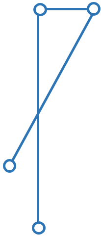<br/>```POLYLINE WITH (STRAIGHTS, ARCS) VERTEX LKoord;```
|**Expected result**|<ul><li>RPO.T01a.xtf: no error message</li></ul>
|**Reference**|[[1]] Chap. 2.8.12 and 3.3.11.12

###### Line strings - RPO.T02
|ID|RPO.T02
|:--|:--
|**Designation**|**Line strings: simple line strings**
|**Description**|The tests must check the validity of a simple polyline ([[1]] Chap. 2.8.12.2, rule ```WITHOUT OVERLAPS```)
|**Test requirement**|[RPO.T02a.xtf](../data/RPO.T02a.xtf), [RPO.T02b.xtf](../data/RPO.T02b.xtf), [RPO.T02c.xtf](../data/RPO.T02c.xtf)
|**Example**|<p align="center">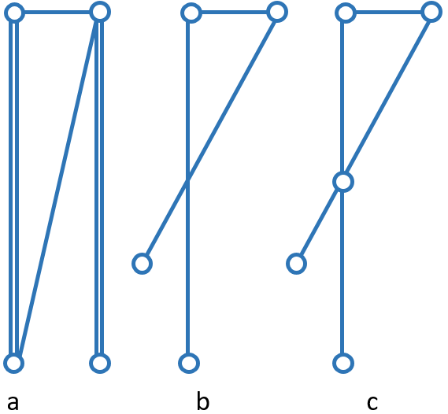<br/>```POLYLINE WITH (STRAIGHTS, ARCS) VERTEX LKoord WITHOUT OVERLAPS > 1;```
|**Expected result**|<ul><li>RPO.T02a.xtf: error message. Self-intersection and segments used several times</li><li>RPO.T02b.xtf: error message. Self-intersection</li><li>RPO.T02c.xtf: no error message</li></ul>
|**Reference**|[[1]] Chap. 2.8.12.2 and 3.3.11.12

###### Line strings - RPO.T03
|ID|RPO.T03
|:--|:--
|**Designation**|**Line strings: tolerance by ARC**
|**Description**|The tests must check the tolerance ([[1]] Chap. 2.8.12.2, rule ```WITHOUT OVERLAPS > 1;```)
|**Test requirement**|[RPO.T03a.xtf](../data/RPO.T03a.xtf), [RPO.T03b.xtf](../data/RPO.T03b.xtf)
|**Example**|<p align="center"><br/>```POLYLINE WITH (STRAIGHTS, ARCS) VERTEX LKoord WITHOUT OVERLAPS > 0.10;```
|**Expected result**|<ul><li>RPO.T03a.xtf: no error message</li><li>RPO.T03b.xtf: error message</li></ul>
|**Reference**|[[1]] Chap. 2.8.12 und 3.3.11.12

## Geometric attributes: Surfaces and Tessellations
|ID|RSU
|:--|:--
|**Designation**|```SURFACE```
|**Description**|For the validation of attribute values of type ```SURFACE```, the rules defined in [[1]] Chap. 3.3.11.13 apply
|**Details**|<ul><li>The values in ```SurfaceValue``` must satisfy the ```AttrTypeDef``` ([[1]] Chap. 2.6 and 2.8.12.2) in the INTERLIS data model</li><li>For the validation of the geometry, the rules defined in [[1]] Chap. 2.8.12 and 2.8.13 apply additionally</li><li>Geometric constraints formulated with the standard function ```areAreas``` ([[1]] Chap. 2.12 and 2.14) must also be checked</li></ul>
|**Reference**|[[1]] Chap. 2.6, 2.8.12, 2.8.12.2, 2.8.13, 2.12, 2.14 and 3.3.11.13

### Test cases
###### Surfaces and Tessellations - RSU.T01
|ID|RSU.T01
|:--|:--
|**Designation**|**Surfaces and tessellations:** ```AREA```
|**Description**|The tests must check whether two polygons satisfy the definition for ```AREA```
|**Test requirement**|[RSU.T01a.xtf](../data/RSU.T01a.xtf), [RSU.T01b.xtf](../data/RSU.T01b.xtf), [RSU.T01c.xtf](../data/RSU.T01c.xtf)
|**Example**|<p align="center">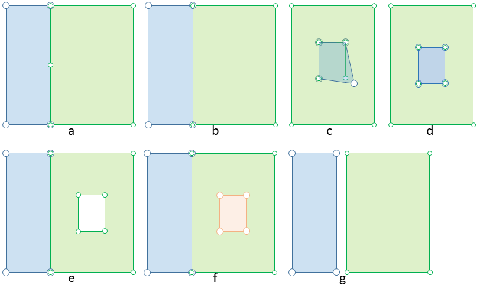</p>
|**Expected result**|<ul><li>RSU.T01a.xtf: error message. The surfaces do not share the same segments (one surface contains an additional control point)</li><li>RSU.T01b.xtf: no error message</li><li>RSU.T01c.xtf: error message. The surfaces do not share the same segments</li></ul>
|**Reference**|[[1]] Chap. 2.8.13 and 3.3.11.13

###### Surfaces and Tessellations - RSU.T02
|ID|RSU.T02
|:--|:--
|**Designation**|**Surfaces and tessellations: validity of the geometry**
|**Description**|The tests must check the validity of the geometry
|**Test requirement**|[RSU.T02a.xtf](../data/RSU.T02a.xtf) (```AREA```), [RSU.T02b.xtf](../data/RSU.T02b.xtf) (```SURFACE```)
|**Example**|<p align="center">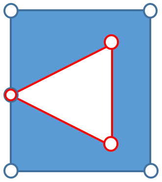</p>
|**Expected result**|<ul><li>RSU.T02a.xtf: no error message</li><li>RSU.T02b.xtf: no error message</li></ul>
|**Reference**|[[1]] Chap. 2.8.13 and 3.3.11.13

###### Surfaces and Tessellations - RSU.T03
|ID|RSU.T03
|:--|:--
|**Designation**|**Surfaces and tessellations: validity of the geometry**
|**Description**|The tests must check the validity of the geometry
|**Test requirement**|[RSU.T03a.xtf](../data/RSU.T03a.xtf) (```AREA```), [RSU.T03b.xtf](../data/RSU.T03b.xtf) (```SURFACE```)
|**Example**|<p align="center">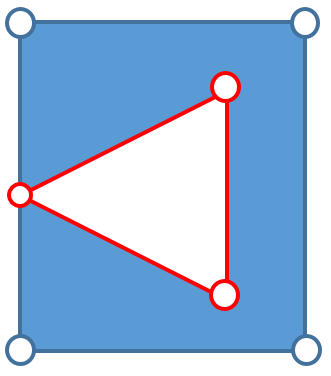</p>
|**Expected result**|<ul><li>RSU.T03a.xtf: error message. *OuterBoundary* not equal to *InnerBoundary*</li><li>RSU.T03b.xtf: error message. *OuterBoundary* not equal to *InnerBoundary*</li></ul>
|**Reference**|[[1]] Chap. 2.8.13 and 3.3.11.13

###### Surfaces and Tessellations - RSU.T04
|ID|RSU.T04
|:--|:--
|**Designation**|**Surfaces and tessellations: validity of the geometry**
|**Description**|The tests must check the validity of the geometry
|**Test requirement**|[RSU.T04a.xtf](../data/RSU.T04a.xtf) (```AREA```), [RSU.T04b.xtf](../data/RSU.T04b.xtf) (```SURFACE```)
|**Example**|<p align="center">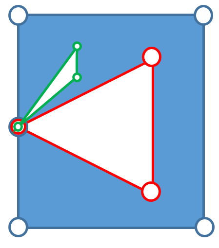</p>
|**Expected result**|<ul><li>RSU.T04a.xtf: no error message</li><li>RSU.T04b.xtf: no error message</li></ul>
|**Reference**|[[1]] Chap. 2.8.13 and 3.3.11.13

###### Surfaces and Tessellations - RSU.T05
|ID|RSU.T05
|:--|:--
|**Designation**|**Surfaces and tessellations: validity of the geometry**
|**Description**|The tests must check the validity of the geometry
|**Test requirement**|[RSU.T05a.xtf](../data/RSU.T05a.xtf) (```AREA```), [RSU.T05b.xtf](../data/RSU.T05b.xtf) (```SURFACE```)
|**Example**|<p align="center"></p>
|**Expected result**|<ul><li>RSU.T05a.xtf: no error message</li><li>RSU.T05b.xtf: no error message</li></ul>
|**Reference**|[[1]] Chap. 2.8.13 and 3.3.11.13

###### Surfaces and Tessellations - RSU.T06
|ID|RSU.T06
|:--|:--
|**Designation**|**Surfaces and tessellations: validity of the geometry**
|**Description**|The tests must check the validity of the geometry
|**Test requirement**|[RSU.T06a.xtf](../data/RSU.T06a.xtf) (```AREA```), [RSU.T06b.xtf](../data/RSU.T06b.xtf) (```SURFACE```)
|**Example**|<p align="center">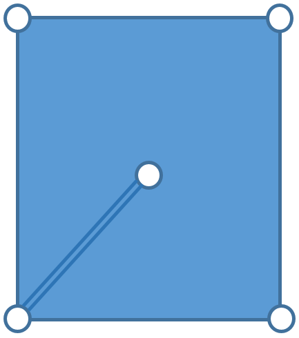</p>
|**Expected result**|<ul><li>RSU.T06a.xtf: error message. Invalid geometry</li><li>RSU.T06b.xtf: error message. Invalid geometry</li></ul>
|**Reference**|[[1]] Chap. 2.8.13 and 3.3.11.13

###### Surfaces and Tessellations - RSU.T07
|ID|RSU.T07
|:--|:--
|**Designation**|**Surfaces and Tessellations: validity of the geometry**
|**Description**|The tests must check the validity of the geometry
|**Test requirement**|[RSU.T07a.xtf](../data/RSU.T07a.xtf) (```AREA```), [RSU.T07b.xtf](../data/RSU.T07b.xtf) (```SURFACE```)
|**Example**|<p align="center">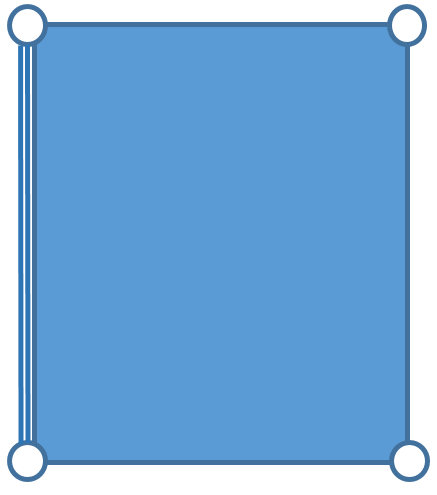</p>
|**Expected result**|<ul><li>RSU.T07a.xtf: error message. Invalid geometry</li><li>RSU.T07b.xtf: error message. Invalid geometry</li></ul>
|**Reference**|[[1]] Chap. 2.8.13 and 3.3.11.13

###### Surfaces and Tessellations - RSU.T08
|ID|RSU.T08
|:--|:--
|**Designation**|**Surfaces and tessellations: validity of the geometry**
|**Description**|The tests must check the validity of the geometry
|**Test requirement**|[RSU.T08a.xtf](../data/RSU.T08a.xtf) (```AREA```), [RSU.T08b.xtf](../data/RSU.T08b.xtf) (```SURFACE```)
|**Example**|<p align="center">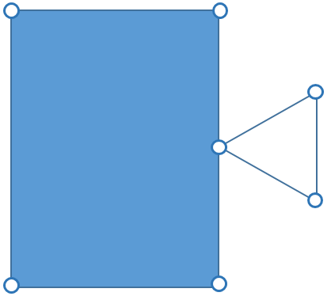</p>
|**Expected result**|<ul><li>RSU.T08a.xtf: error message. *InnerBoundary* is not inside the *OuterBoundary*</li><li>RSU.T08b.xtf: error message. *InnerBoundary* is not inside the *OuterBoundary*</li></ul>
|**Reference**|[[1]] Chap. 2.8.13 and 3.3.11.13

###### Surfaces and Tessellations - RSU.T09
|ID|RSU.T09
|:--|:--
|**Designation**|**Surfaces and tessellations: validity of the geometry**
|**Description**|The tests must check the validity of the geometry
|**Test requirement**|[RSU.T09a.xtf](../data/RSU.T09a.xtf) (```AREA```), [RSU.T09b.xtf](../data/RSU.T09b.xtf) (```SURFACE```)
|**Example**|<p align="center">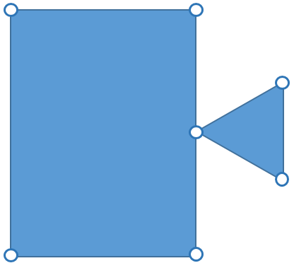</p>
|**Expected result**|<ul><li>RSU.T09a.xtf: error message. Multipolygon</li><li>RSU.T09b.xtf: error message. Multipolygon</li></ul>
|**Reference**|[[1]] Chap. 2.8.13 and 3.3.11.13

###### Surfaces and Tessellations - RSU.T10
|ID|RSU.T10
|:--|:--
|**Designation**|**Surfaces and tessellations: validity of the geometry**
|**Description**|The tests must check the validity of the geometry
|**Test requirement**|[RSU.T10a.xtf](../data/RSU.T10a.xtf) (```AREA```), [RSU.T10b.xtf](../data/RSU.T10b.xtf) (```SURFACE```)
|**Example**|<p align="center"></p>
|**Expected result**|<ul><li>RSU.T10a.xtf: error message. Invalid geometry</li><li>RSU.T10b.xtf: error message. Invalid geometry</li></ul>
|**Reference**|[[1]] Chap. 2.8.13 and 3.3.11.13

###### Surfaces and Tessellations - RSU.T11
|ID|RSU.T11
|:--|:--
|**Designation**|**Surfaces and tessellations: validity of the geometry**
|**Description**|The tests must check the validity of the geometry
|**Test requirement**|[RSU.T11a.xtf](../data/RSU.T011.xtf) (```AREA```), [RSU.T011.xtf](../data/RSU.T011.xtf) (```SURFACE```)
|**Example**|<p align="center">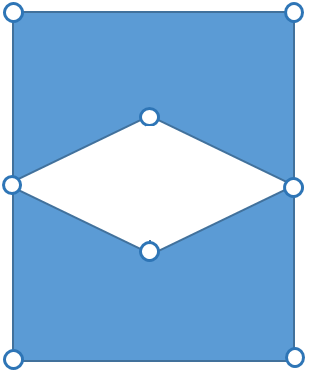</p>
|**Expected result**|<ul><li>RSU.T11a.xtf: error message. Invalid geometry</li><li>RSU.T11b.xtf: error message. Invalid geometry</li></ul>
|**Reference**|[[1]] Chap. 2.8.13 and 3.3.11.13

###### Surfaces and Tessellations - RSU.T12
|ID|RSU.T12
|:--|:--
|**Designation**|**Surfaces and tessellations: validity of the geometry**
|**Description**|The tests must check the validity of the geometry
|**Test requirement**|[RSU.T12a.xtf](../data/RSU.T12a.xtf) (```AREA```), [RSU.T12b.xtf](../data/RSU.T12b.xtf) (```SURFACE```)
|**Example**|<p align="center">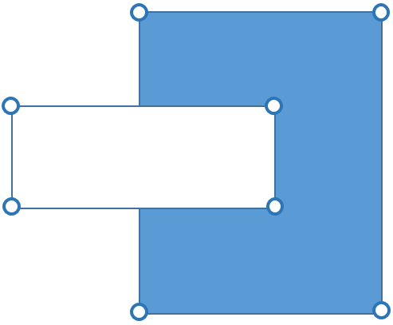</p>
|**Expected result**|<ul><li>RSU.T12a.xtf: error message. Invalid geometry</li><li>RSU.T12b.xtf: error message. Invalid geometry</li></ul>
|**Reference**|[[1]] Chap. 2.8.13 and 3.3.11.13

###### Surfaces and Tessellations - RSU.T13
|ID|RSU.T13
|:--|:--
|**Designation**|**Surfaces and tessellations: validity of the geometry**
|**Description**|The tests must check the validity of the geometry
|**Test requirement**|[RSU.T13a.xtf](../data/RSU.T13a.xtf) (```AREA```), [RSU.T13b.xtf](../data/RSU.T13b.xtf) (```SURFACE```)
|**Example**|<p align="center">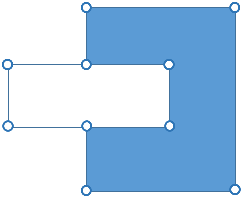</p>
|**Expected result**|<ul><li>RSU.T13a.xtf: error message. Invalid geometry</li><li>RSU.T13b.xtf: error message. Invalid geometry</li></ul>
|**Reference**|[[1]] Chap. 2.8.13 and 3.3.11.13

## Cardinality
|ID|RKA
|:--|:--
|**Designation**|**Cardinality of attributes**
|**Description**|For the validation of the cardinality, the number of necessary/allowed objects must satisfy the ```AttrTypeDef``` ([[1]] Chap. 2.6.1) in the INTERLIS data model
|**Details**|<ul><li>The rules defined in [[1]] Chap. 2.7.3 apply additionally</li></ul>
|**Reference**| [[1]] Chap. 2.6.1 and 2.7.3

### Test cases
###### Cardinality - RKA.T01
|ID|RKA.T01
|:--|:--
|**Designation**|**Cardinality:** ```MANDATORY```
|**Description**|The tests must check the rules for the cardinality of attributes
|**Test requirement**|[RKA.T01a.xtf](../data/RKA.T01a.xtf), [RKA.T01b.xtf](../data/RKA.T01b.xtf)
|**Expected result**|<ul><li>RKA.T01a.xtf: no error message</li><li>RKA.T01b.xtf: error message. Mandatory attribute missing</li></ul>
|**Reference**|[[1]] Chap. 2.6.1 and 2.7.3

###### Cardinality - RKA.T02
|ID|RKA.T02
|:--|:--
|**Designation**|**Cardinality:** ```BAG OF```
|**Description**|The tests must check the rules for the cardinality of attributes
|**Test requirement**|[RKA.T02a.xtf](../data/RKA.T02a.xtf), [RKA.T02b.xtf](../data/RKA.T02b.xtf), [RKA.T02c.xtf](../data/RKA.T02c.xtf), [RKA.T02d.xtf](../data/RKA.T02d.xtf)
|**Expected result**|<ul><li>RKA.T02a.xtf: no error message</li><li>RKA.T02b.xtf: error message. Mandatory attribute missing</li><li>RKA.T02c.xtf: error message. The structure must not occur more than twice</li><li>RKA.T02d.xtf: error message. Wrong encoding (multiple tags ```Namen```)</li></ul>
|**Reference**|[[1]] Chap. 2.6.1 and 2.7.3

[1]: bib.md#1-cogis-interlis-version-2--reference-manual-13042006
[2]: bib.md#2-w3c-extensible-markup-language-xml-10-fifth-edition-26112008
[3]: bib.md#3-ietf-rfc-uniform-resource-identifiers-uri-generic-syntax-08-1998
[4]: bib.md#4-w3c-xmlid-version-10-09-09-2005-online-available-httpswwww3orgtrxml-id
